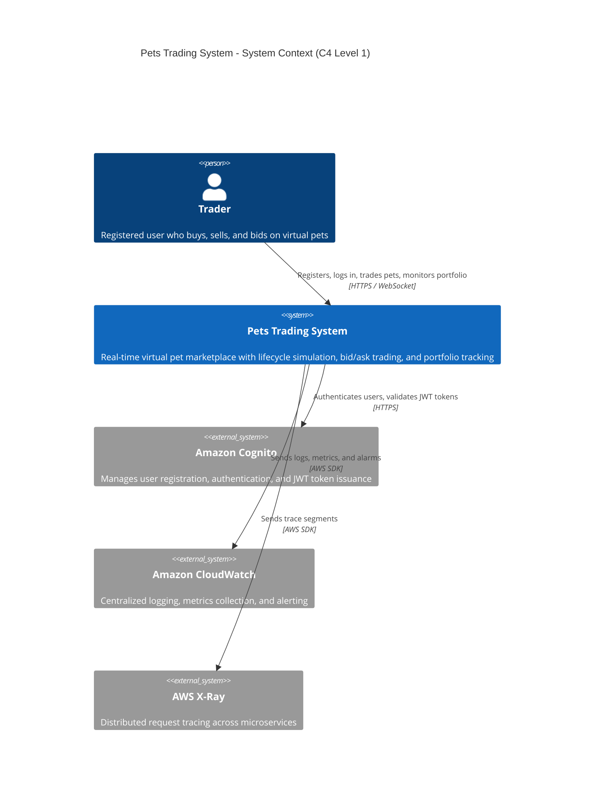

# arc42: 03 -- Context and Scope

## 3.1 Business Context

The Pets Trading System operates as a self-contained web application with no external system integrations beyond AWS managed services. All traders interact through a single React frontend that communicates with backend microservices via API Gateway.

### External Actors

| Actor | Description | Interface |
|-------|-------------|-----------|
| **Trader (Human)** | Registers, logs in, buys/sells/bids on pets, monitors portfolio | Web browser (React SPA) |
| **Lifecycle Timer** | System-internal scheduled process | Backend tick loop (60s interval) |

### External Systems

| System | Purpose | Protocol |
|--------|---------|----------|
| **Amazon Cognito** | User authentication and session management | OAuth 2.0 / JWT |
| **AWS CloudWatch** | Logging, metrics, alarms | AWS SDK |
| **AWS X-Ray** | Distributed tracing | AWS SDK |

## 3.2 Technical Context

```
                              Internet
                                 |
                         +--------------+
                         |  CloudFront  |
                         |    (CDN)     |
                         +--------------+
                          /            \
                    Static assets    API requests
                         |               |
                   +----------+    +-----------+
                   | S3 Bucket|    |API Gateway |
                   | (React)  |    |(REST+WS)  |
                   +----------+    +-----------+
                                        |
                              +------------------+
                              | Application Load |
                              |    Balancer      |
                              +------------------+
                                   |        |
                            +------+  +-----+------+
                            | ECS  |  | ECS        |
                            |Trading|  |Lifecycle   |
                            |Service|  |Service     |
                            +------+  +------------+
                                   \       /
                              +-------------+
                              | RDS PostgreSQL|
                              | (Multi-AZ)   |
                              +---------------+
```

## C4 Level 1 -- System Context Diagram



## 3.3 External Interfaces

### Frontend to Backend (REST API)

| Endpoint Group | Method | Path Pattern | Description |
|---------------|--------|--------------|-------------|
| Auth | POST | `/api/auth/register` | Register new trader |
| Auth | POST | `/api/auth/login` | Authenticate trader |
| Auth | POST | `/api/auth/logout` | End session |
| Supply | GET | `/api/supply` | List available supply by breed |
| Supply | POST | `/api/supply/purchase` | Purchase pet from supply |
| Pets | GET | `/api/pets/{id}` | Get pet details (analysis view) |
| Inventory | GET | `/api/traders/me/inventory` | Get current trader's inventory |
| Listings | GET | `/api/listings` | Get all active market listings |
| Listings | POST | `/api/listings` | Create a new listing |
| Listings | DELETE | `/api/listings/{id}` | Withdraw a listing |
| Bids | POST | `/api/listings/{id}/bids` | Place a bid |
| Bids | DELETE | `/api/bids/{id}` | Withdraw a bid |
| Bids | POST | `/api/bids/{id}/accept` | Accept a bid (seller) |
| Bids | POST | `/api/bids/{id}/reject` | Reject a bid (seller) |
| Portfolio | GET | `/api/traders/me/portfolio` | Get portfolio summary |
| Account | POST | `/api/traders/me/topup` | Top up balance |
| Account | POST | `/api/traders/me/withdraw` | Withdraw balance |
| Leaderboard | GET | `/api/leaderboard` | Get all traders ranked by portfolio value |
| Notifications | GET | `/api/traders/me/notifications` | Get trader's notifications |

### Real-Time (WebSocket)

| Channel | Direction | Payload | Description |
|---------|-----------|---------|-------------|
| `trade.executed` | Server -> Client | Trade details | Trade completed notification |
| `bid.updated` | Server -> Client | Bid event | Bid placed/withdrawn/outbid |
| `tick.completed` | Server -> Client | Updated pet values | Lifecycle tick results |
| `leaderboard.updated` | Server -> Client | Rankings | Portfolio value changes |
| `notification.new` | Server -> Client | Notification | Private notification for trader |
