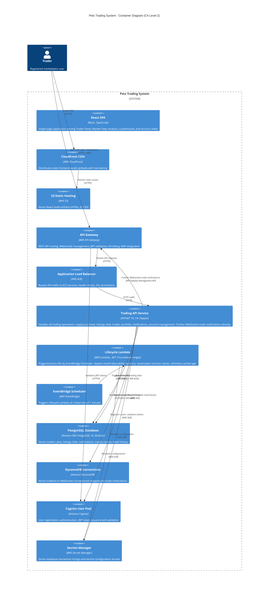
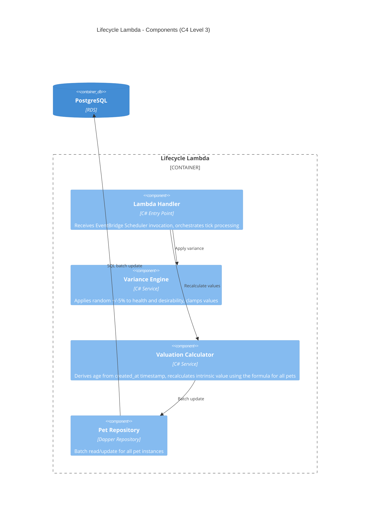

# arc42: 05 -- Building Block View

## C4 Level 2 -- Container Diagram



## Container Descriptions

### React SPA (Frontend)
**Technology:** React 18, TypeScript, Vite bundler
**Responsibility:** Renders all trader-facing views and manages client-side state.
**Data Refresh:** Polls REST API every 5 seconds for market data, leaderboard, portfolio, and analysis views. Receives WebSocket trade notifications and immediately invalidates/refetches affected queries.
**Key Views:**
- Auth pages (Login, Register)
- Trader Panel (private: cash, inventory, notifications)
- Market View (shared: listings, supply, recent trades)
- Analysis / Drill-Down (pet fundamentals)
- Leaderboard (all traders, ranked)
- Account Page (summary, top-up, withdraw)

### API Gateway
**Technology:** AWS API Gateway (REST API + WebSocket API)
**Responsibility:** Single entry point for all client-server communication.
- REST API: Routes requests to ALB -> ECS services
- WebSocket API: Manages persistent connections for trade notification push
- Cognito authorizer validates JWT on every request
- WAF rules protect against common web attacks
- Throttling: 1000 requests/second (configurable)

### Trading API Service
**Technology:** ASP.NET 10 Web API, Dapper ORM
**Responsibility:** Core business logic for all trading operations. Also responsible for pushing WebSocket trade notifications directly to connected traders via API Gateway Management API.
**Key Components:**
- AuthController: Proxies registration/login to Cognito
- SupplyController: Browse and purchase from new supply
- ListingController: Create, withdraw, view listings
- BidController: Place, withdraw, accept, reject bids
- TradeController: Execute trades (ownership + cash transfer)
- PortfolioController: Portfolio summary, inventory
- AccountController: Top-up, withdraw balance
- LeaderboardController: All trader rankings
- NotificationController: Trader's notification history
- AnalysisController: Pet fundamentals drill-down
- WebSocketNotificationService: Reads DynamoDB connection table, pushes trade events via API Gateway Management API

### Lifecycle Lambda
**Technology:** AWS Lambda (.NET 10, container image deployment)
**Responsibility:** Periodic pet value updates, triggered every 60 seconds by EventBridge Scheduler.
- Derives pet age from `created_at` timestamp: `age = (NOW() - created_at)` in years (ADR-016)
- Applies random variance: health +/-5%, desirability +/-5%
- Clamps values: health [0, 100], desirability [0, breed_max]
- Recalculates intrinsic value for every pet
- Refreshes cached `age` column and `is_expired` flag in PostgreSQL
- No event publishing -- frontend polls for updated data (ADR-017)

### PostgreSQL Database
**Technology:** Amazon RDS PostgreSQL 16, Multi-AZ, db.t3.medium
**Responsibility:** Persistent storage for all application state.
**Key Tables:** traders, pets, pet_dictionary, listings, bids, trades, notifications, supply_inventory

---

## C4 Level 3 -- Component Diagrams

### Trading API Service -- Component Diagram

```mermaid
C4Component
    title Trading API Service - Components (C4 Level 3)

    Container_Boundary(trading, "Trading API Service") {
        Component(auth_ctrl, "Auth Controller", "ASP.NET Controller", "Registration, login, logout -- proxies to Cognito")
        Component(supply_ctrl, "Supply Controller", "ASP.NET Controller", "Browse supply, purchase new pets")
        Component(listing_ctrl, "Listing Controller", "ASP.NET Controller", "Create/withdraw listings")
        Component(bid_ctrl, "Bid Controller", "ASP.NET Controller", "Place/withdraw/accept/reject bids")
        Component(portfolio_ctrl, "Portfolio Controller", "ASP.NET Controller", "Portfolio summary, inventory view")
        Component(account_ctrl, "Account Controller", "ASP.NET Controller", "Top-up and withdraw balance")
        Component(leaderboard_ctrl, "Leaderboard Controller", "ASP.NET Controller", "All-trader rankings")
        Component(notif_ctrl, "Notification Controller", "ASP.NET Controller", "Notification history retrieval")
        Component(analysis_ctrl, "Analysis Controller", "ASP.NET Controller", "Pet fundamentals drill-down")

        Component(trade_svc, "Trade Service", "C# Service", "Core trading business logic: validates rules, executes trades, manages cash/inventory transfers")
        Component(bid_svc, "Bid Service", "C# Service", "Bid validation, highest-bid replacement, cash locking/release")
        Component(supply_svc, "Supply Service", "C# Service", "Supply inventory management, purchase validation")
        Component(valuation_svc, "Valuation Service", "C# Service", "Intrinsic value calculation using the formula")
        Component(notif_svc, "Notification Service", "C# Service", "Creates notification records, pushes WebSocket trade events via API Gateway Management API")
        Component(portfolio_svc, "Portfolio Service", "C# Service", "Calculates portfolio value: availableCash + lockedCash + sum(intrinsicValue)")
        Component(ws_svc, "WebSocket Notification Service", "C# Service", "Reads DynamoDB connection table, pushes messages to API Gateway Management API")

        Component(trader_repo, "Trader Repository", "Dapper Repository", "CRUD operations for trader accounts and balances")
        Component(pet_repo, "Pet Repository", "Dapper Repository", "CRUD operations for pet instances and dictionary")
        Component(listing_repo, "Listing Repository", "Dapper Repository", "CRUD for listings")
        Component(bid_repo, "Bid Repository", "Dapper Repository", "CRUD for bids")
        Component(trade_repo, "Trade Repository", "Dapper Repository", "Trade history records")
        Component(notif_repo, "Notification Repository", "Dapper Repository", "Notification persistence")
    }

    ContainerDb(db, "PostgreSQL", "RDS")
    Container_Ext(cognito, "Cognito", "Auth")
    Container_Ext(dynamo, "DynamoDB", "Connections")
    Container_Ext(apigw_mgmt, "API Gateway Management API", "WebSocket Push")

    Rel(auth_ctrl, cognito, "Register/Login")
    Rel(supply_ctrl, supply_svc, "")
    Rel(listing_ctrl, trade_svc, "")
    Rel(bid_ctrl, bid_svc, "")
    Rel(bid_ctrl, trade_svc, "Accept bid -> execute trade")
    Rel(portfolio_ctrl, portfolio_svc, "")
    Rel(account_ctrl, trader_repo, "")
    Rel(leaderboard_ctrl, portfolio_svc, "")
    Rel(analysis_ctrl, valuation_svc, "")

    Rel(trade_svc, bid_svc, "Release locked cash on trade")
    Rel(trade_svc, notif_svc, "Send trade notifications")
    Rel(bid_svc, notif_svc, "Send bid notifications")
    Rel(bid_svc, valuation_svc, "Validate bid amounts")
    Rel(notif_svc, ws_svc, "Push WebSocket event")
    Rel(ws_svc, dynamo, "Read connectionId")
    Rel(ws_svc, apigw_mgmt, "Post to connection")

    Rel(trader_repo, db, "SQL")
    Rel(pet_repo, db, "SQL")
    Rel(listing_repo, db, "SQL")
    Rel(bid_repo, db, "SQL")
    Rel(trade_repo, db, "SQL")
    Rel(notif_repo, db, "SQL")
```



### Lifecycle Lambda -- Component Diagram



## Database Schema (Key Tables)

```sql
-- Traders
CREATE TABLE traders (
    id UUID PRIMARY KEY DEFAULT gen_random_uuid(),
    cognito_sub VARCHAR(128) UNIQUE NOT NULL,
    email VARCHAR(255) UNIQUE NOT NULL,
    available_cash DECIMAL(12,2) NOT NULL DEFAULT 150.00,
    locked_cash DECIMAL(12,2) NOT NULL DEFAULT 0.00,
    created_at TIMESTAMPTZ NOT NULL DEFAULT NOW(),
    updated_at TIMESTAMPTZ NOT NULL DEFAULT NOW()
);

-- Pet Dictionary (read-only, seeded once)
CREATE TABLE pet_dictionary (
    id SERIAL PRIMARY KEY,
    type VARCHAR(10) NOT NULL,      -- Dog, Cat, Bird, Fish
    breed VARCHAR(50) NOT NULL,
    lifespan INTEGER NOT NULL,       -- years
    desirability DECIMAL(4,2) NOT NULL,
    maintenance DECIMAL(4,2) NOT NULL,
    base_price DECIMAL(10,2) NOT NULL,
    initial_supply INTEGER NOT NULL DEFAULT 3,
    UNIQUE(type, breed)
);

-- Pet Instances
-- NOTE: `age` is a CACHE COLUMN derived from created_at (ADR-016).
-- Canonical age = EXTRACT(EPOCH FROM (NOW() - created_at)) / (365.25 * 24 * 3600)
-- The cached value is refreshed on every lifecycle tick for query convenience.
-- `is_expired` is also derived: age >= lifespan (refreshed each tick).
CREATE TABLE pets (
    id UUID PRIMARY KEY DEFAULT gen_random_uuid(),
    dictionary_id INTEGER NOT NULL REFERENCES pet_dictionary(id),
    owner_id UUID NOT NULL REFERENCES traders(id),
    age DECIMAL(10,8) NOT NULL DEFAULT 0,           -- cache: derived from created_at
    health DECIMAL(5,2) NOT NULL DEFAULT 100.00,
    desirability DECIMAL(5,2) NOT NULL,
    intrinsic_value DECIMAL(10,2) NOT NULL,
    is_expired BOOLEAN NOT NULL DEFAULT FALSE,       -- cache: derived as age >= lifespan
    created_at TIMESTAMPTZ NOT NULL DEFAULT NOW(),   -- source of truth for age
    updated_at TIMESTAMPTZ NOT NULL DEFAULT NOW()
);

-- Supply Inventory
CREATE TABLE supply_inventory (
    dictionary_id INTEGER PRIMARY KEY REFERENCES pet_dictionary(id),
    remaining INTEGER NOT NULL DEFAULT 3
);

-- Listings
CREATE TABLE listings (
    id UUID PRIMARY KEY DEFAULT gen_random_uuid(),
    pet_id UUID UNIQUE NOT NULL REFERENCES pets(id),
    seller_id UUID NOT NULL REFERENCES traders(id),
    asking_price DECIMAL(10,2) NOT NULL CHECK (asking_price > 0),
    is_active BOOLEAN NOT NULL DEFAULT TRUE,
    created_at TIMESTAMPTZ NOT NULL DEFAULT NOW()
);

-- Bids
CREATE TABLE bids (
    id UUID PRIMARY KEY DEFAULT gen_random_uuid(),
    listing_id UUID NOT NULL REFERENCES listings(id),
    bidder_id UUID NOT NULL REFERENCES traders(id),
    amount DECIMAL(10,2) NOT NULL CHECK (amount > 0),
    status VARCHAR(20) NOT NULL DEFAULT 'active',  -- active, accepted, rejected, withdrawn, outbid
    created_at TIMESTAMPTZ NOT NULL DEFAULT NOW(),
    updated_at TIMESTAMPTZ NOT NULL DEFAULT NOW()
);

-- Trades
CREATE TABLE trades (
    id UUID PRIMARY KEY DEFAULT gen_random_uuid(),
    listing_id UUID NOT NULL REFERENCES listings(id),
    pet_id UUID NOT NULL REFERENCES pets(id),
    seller_id UUID NOT NULL REFERENCES traders(id),
    buyer_id UUID NOT NULL REFERENCES traders(id),
    trade_price DECIMAL(10,2) NOT NULL,
    executed_at TIMESTAMPTZ NOT NULL DEFAULT NOW()
);

-- Notifications
CREATE TABLE notifications (
    id UUID PRIMARY KEY DEFAULT gen_random_uuid(),
    trader_id UUID NOT NULL REFERENCES traders(id),
    event_type VARCHAR(30) NOT NULL,  -- bid_received, bid_accepted, bid_rejected, bid_withdrawn, outbid, trade_completed, listing_withdrawn
    pet_breed VARCHAR(50) NOT NULL,
    amount DECIMAL(10,2) NOT NULL,
    counterparty_email VARCHAR(255) NOT NULL,
    message TEXT NOT NULL,
    created_at TIMESTAMPTZ NOT NULL DEFAULT NOW()
);

-- Indexes
CREATE INDEX idx_pets_owner ON pets(owner_id);
CREATE INDEX idx_listings_active ON listings(is_active) WHERE is_active = TRUE;
CREATE INDEX idx_bids_listing_active ON bids(listing_id, status) WHERE status = 'active';
CREATE INDEX idx_notifications_trader ON notifications(trader_id, created_at DESC);
CREATE INDEX idx_trades_breed ON trades(pet_id);
```
