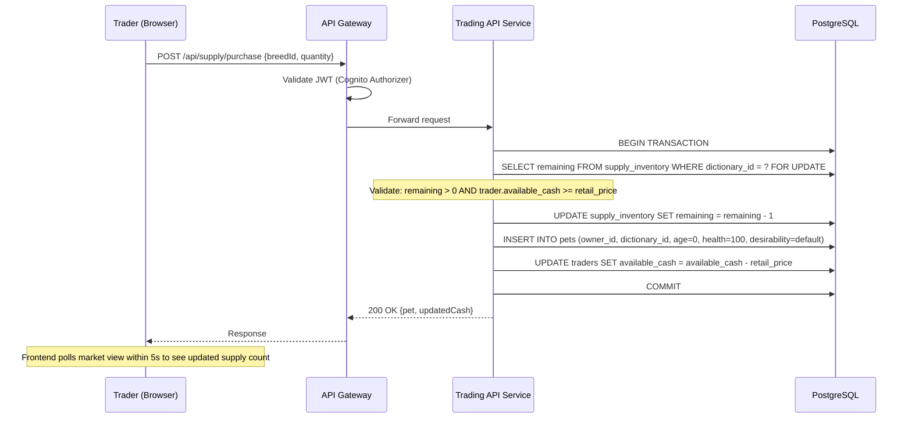
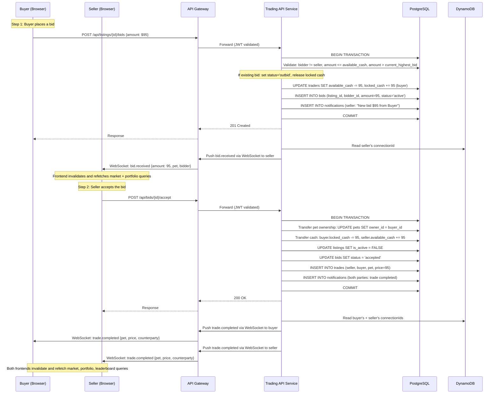
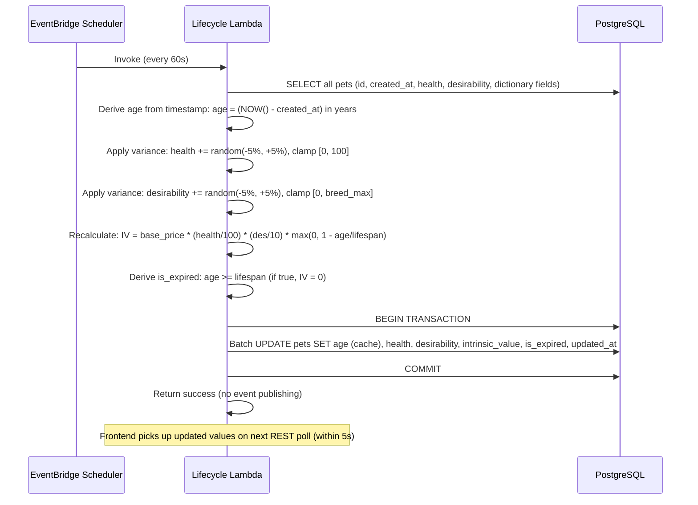
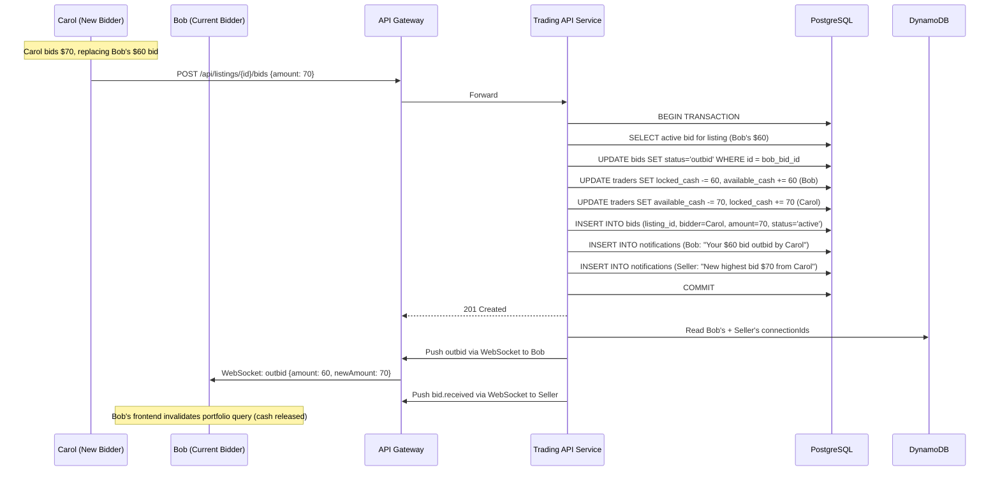
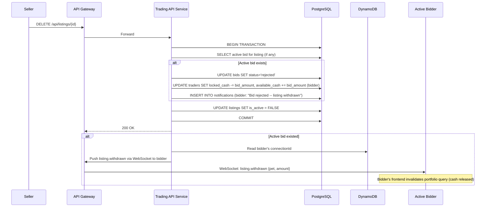
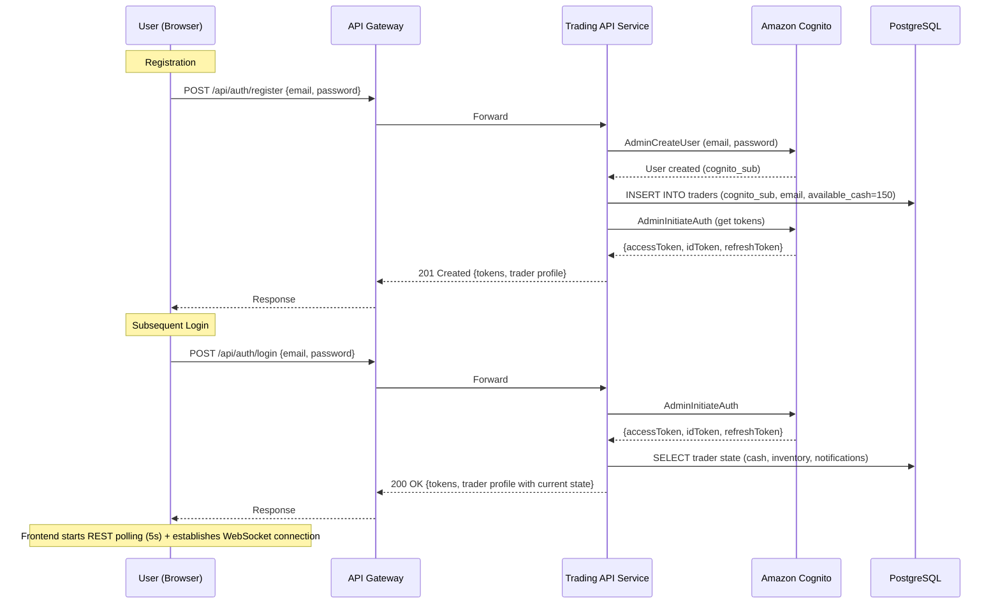

# arc42: 06 -- Runtime View

## 6.1 New Supply Purchase Flow

## 6.2 Secondary Market Trade Flow (Bid -> Accept)

## 6.3 Lifecycle Tick Flow

## 6.4 Outbid Flow

## 6.5 Listing Withdrawal Flow

## 6.6 User Registration and Login Flow

## 6.7 Failure Modes

| Failure | Detection | Response | Recovery |
|---------|-----------|----------|----------|
| Lifecycle Lambda DB write fails | Lambda error in CloudWatch | Log error, Lambda retries (EventBridge retry policy) | Pets retain previous tick's health/desirability; age is always correct (timestamp-derived) |
| WebSocket connection drops | API Gateway connection timeout | Client reconnects with exponential backoff | REST polling continues uninterrupted; no data loss |
| RDS failover (Multi-AZ) | RDS automatic failover | ~60s downtime during DNS update | ECS services and Lambda reconnect automatically; transactions replay |
| Lambda cold start | Increased latency on first invocation | Provisioned concurrency (optional) | Subsequent invocations are warm; 60s interval keeps Lambda warm |
| API Gateway throttle | 429 response | Client retries with backoff | Frontend shows "please wait" message; polling interval unaffected |
| DynamoDB connection table read fails | Trading API catches exception | Trade notification not pushed via WebSocket | Notification persisted in PostgreSQL; trader sees it on next poll or page refresh |
