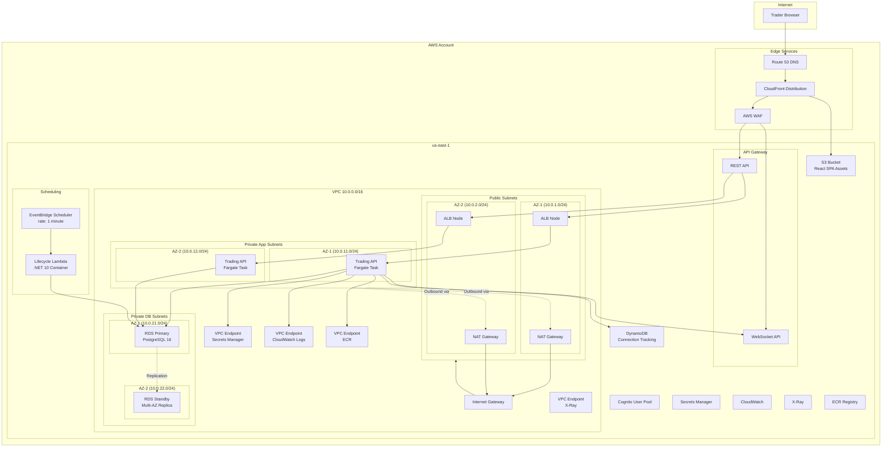
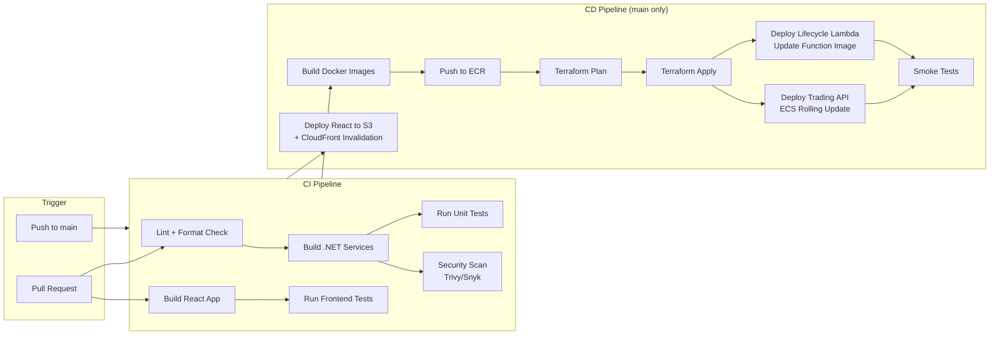

# arc42: 07 -- Deployment View

## Infrastructure Diagram

## Network Topology

### VPC Design

| Component | CIDR | Description |
|-----------|------|-------------|
| **VPC** | `10.0.0.0/16` | Main VPC (65,536 IPs) |
| **Public Subnet AZ-1** | `10.0.1.0/24` | ALB, NAT Gateway (AZ us-east-1a) |
| **Public Subnet AZ-2** | `10.0.2.0/24` | ALB, NAT Gateway (AZ us-east-1b) |
| **Private App Subnet AZ-1** | `10.0.11.0/24` | ECS Fargate tasks (AZ us-east-1a) |
| **Private App Subnet AZ-2** | `10.0.12.0/24` | ECS Fargate tasks (AZ us-east-1b) |
| **Private DB Subnet AZ-1** | `10.0.21.0/24` | RDS Primary (AZ us-east-1a) |
| **Private DB Subnet AZ-2** | `10.0.22.0/24` | RDS Standby (AZ us-east-1b) |

### Internet Gateway
- Attached to VPC
- Routes `0.0.0.0/0` from public subnets

### NAT Gateways
- One per AZ in public subnets
- Enables outbound internet for ECS tasks in private subnets (ECR image pulls, AWS API calls)
- Elastic IP assigned to each NAT Gateway

### Route Tables

| Route Table | Destination | Target | Purpose |
|-------------|------------|--------|---------|
| Public RT | `0.0.0.0/0` | Internet Gateway | Inbound internet traffic |
| Public RT | `10.0.0.0/16` | local | VPC internal |
| Private App RT AZ-1 | `0.0.0.0/0` | NAT Gateway AZ-1 | Outbound internet |
| Private App RT AZ-1 | `10.0.0.0/16` | local | VPC internal |
| Private App RT AZ-2 | `0.0.0.0/0` | NAT Gateway AZ-2 | Outbound internet |
| Private DB RT | `10.0.0.0/16` | local | VPC internal only (no internet) |

### Security Groups

| Security Group | Inbound | Outbound | Attached To |
|----------------|---------|----------|-------------|
| **sg-alb** | TCP 443 from `0.0.0.0/0` (HTTPS) | TCP 8080 to sg-ecs | Application Load Balancer |
| **sg-ecs** | TCP 8080 from sg-alb | TCP 5432 to sg-rds, TCP 443 to VPC endpoints | ECS Fargate Tasks (Trading API) |
| **sg-lambda** | None (Lambda initiates outbound only) | TCP 5432 to sg-rds, TCP 443 to VPC endpoints | Lifecycle Lambda (VPC-attached) |
| **sg-rds** | TCP 5432 from sg-ecs, TCP 5432 from sg-lambda | None (deny all) | RDS PostgreSQL |
| **sg-vpce** | TCP 443 from sg-ecs, TCP 443 from sg-lambda | None | VPC Endpoints |

### VPC Endpoints (PrivateLink)

| Endpoint | Type | Purpose |
|----------|------|---------|
| `com.amazonaws.us-east-1.secretsmanager` | Interface | Secrets Manager access without NAT |
| `com.amazonaws.us-east-1.logs` | Interface | CloudWatch Logs without NAT |
| `com.amazonaws.us-east-1.ecr.api` | Interface | ECR API without NAT |
| `com.amazonaws.us-east-1.ecr.dkr` | Interface | ECR Docker registry without NAT |
| `com.amazonaws.us-east-1.s3` | Gateway | S3 access for ECR image layers |
| `com.amazonaws.us-east-1.xray` | Interface | X-Ray trace submission |
| `com.amazonaws.us-east-1.execute-api` | Interface | API Gateway Management API (Trading API -> WebSocket push) |
| `com.amazonaws.us-east-1.dynamodb` | Gateway | DynamoDB access for connection tracking |

### DNS (Route 53)

| Record | Type | Target | Purpose |
|--------|------|--------|---------|
| `pets.example.com` | A (Alias) | CloudFront Distribution | Frontend |
| `api.pets.example.com` | A (Alias) | API Gateway Custom Domain | REST API |
| `ws.pets.example.com` | A (Alias) | API Gateway WebSocket | WebSocket |

### WAF Rules (API Gateway)

| Rule | Action | Purpose |
|------|--------|---------|
| AWS Managed - Common Rule Set | Block | OWASP Top 10 protection |
| AWS Managed - Known Bad Inputs | Block | SQL injection, XSS |
| Rate limiting | Block (>2000 req/5min per IP) | DDoS mitigation |
| Geo restriction | Allow (configurable) | Optional region restriction |

### Application Load Balancer

| Configuration | Value |
|--------------|-------|
| Scheme | Internal (API Gateway -> ALB via VPC Link) |
| Target Group - Trading API | Port 8080, health check `/health`, interval 30s |
| Listener | HTTP 8080, forward to Trading API target group |
| Deregistration delay | 30s |
| Stickiness | Disabled (stateless API) |

## ECS Service Configuration

### Trading API Service

| Parameter | Value |
|-----------|-------|
| Launch type | Fargate |
| CPU | 512 (0.5 vCPU) |
| Memory | 1024 MB |
| Desired count | 2 (one per AZ) |
| Min/Max (auto-scaling) | 2 / 4 |
| Scale metric | CPU > 70% for 3 minutes |
| Platform version | LATEST |
| Container port | 8080 |
| Image source | ECR |
| Log driver | awslogs (CloudWatch) |

## Lambda Configuration

### Lifecycle Lambda

| Parameter | Value |
|-----------|-------|
| Runtime | .NET 10 container image |
| Memory | 512 MB |
| Timeout | 60 seconds |
| Trigger | EventBridge Scheduler (rate: 1 minute) |
| VPC | Yes (private app subnets, sg-lambda) |
| Image source | ECR |
| Log group | `/lambda/lifecycle-engine` |
| Retry policy | 0 retries (next scheduled invocation will process) |
| Dead letter queue | None (idempotent; next tick catches up) |

**Note:** The Lifecycle Lambda replaces the previous ECS Fargate singleton (ADR-015). No singleton coordination is needed -- EventBridge Scheduler guarantees one invocation per schedule.

## RDS Configuration

| Parameter | Value |
|-----------|-------|
| Engine | PostgreSQL 16 |
| Instance class | db.t3.medium (2 vCPU, 4 GB RAM) |
| Storage | 20 GB gp3, auto-scaling up to 100 GB |
| Multi-AZ | Enabled |
| Backup retention | 7 days |
| Backup window | 03:00-04:00 UTC |
| Maintenance window | Sun 04:00-05:00 UTC |
| IAM authentication | Enabled (passwordless) |
| Encryption at rest | AES-256 (AWS managed key) |
| Public access | Disabled |
| Performance Insights | Enabled |

## DynamoDB Configuration

### WebSocket Connections Table

| Parameter | Value |
|-----------|-------|
| Table name | `pts-websocket-connections` |
| Partition key | `traderId` (String) |
| Attributes | `connectionId` (String), `connectedAt` (String) |
| Billing mode | On-demand (pay-per-request) |
| TTL | Enabled on `ttl` attribute (auto-cleanup stale connections) |

## CI/CD Pipeline (GitHub Actions)

### Pipeline Stages

| Stage | Trigger | Actions |
|-------|---------|---------|
| **Lint & Build** | PR + push to main | `dotnet format --verify-no-changes`, `dotnet build`, `npm run lint`, `npm run build` |
| **Test** | PR + push to main | `dotnet test`, `npm test` |
| **Security Scan** | PR + push to main | Trivy container scan, dependency audit |
| **Docker Build** | Push to main | Build Trading API + Lifecycle Lambda images |
| **Push to ECR** | Push to main | Tag with commit SHA + `latest`, push to ECR |
| **Terraform** | Push to main | `terraform plan` -> `terraform apply -auto-approve` |
| **Deploy ECS** | After Terraform | `aws ecs update-service --force-new-deployment` (Trading API only) |
| **Deploy Lambda** | After Terraform | `aws lambda update-function-code --image-uri` (Lifecycle Lambda) |
| **Deploy Frontend** | Push to main | `aws s3 sync build/ s3://bucket/`, CloudFront cache invalidation |
| **Smoke Test** | After deployment | HTTP health check on API, invoke Lifecycle Lambda test, verify WebSocket connectivity |

### Environment Configuration

| Environment | Purpose | Infrastructure |
|-------------|---------|---------------|
| **dev** | Development and testing | Minimal: single AZ, no Multi-AZ RDS, smaller instances |
| **prod** | Live demo and judging | Full: Multi-AZ, NAT Gateways, WAF, CloudFront |

Terraform workspaces (`dev`, `prod`) manage environment-specific variable files.
